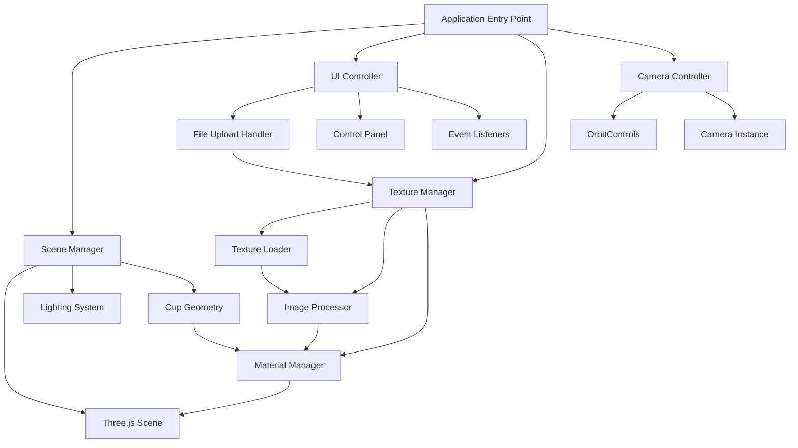
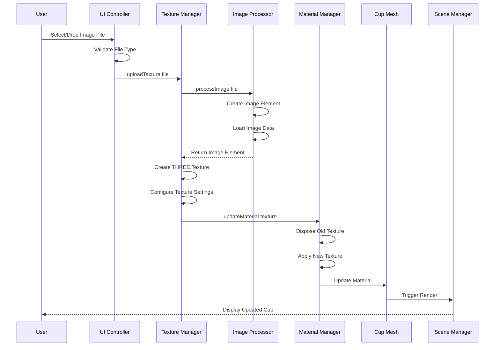
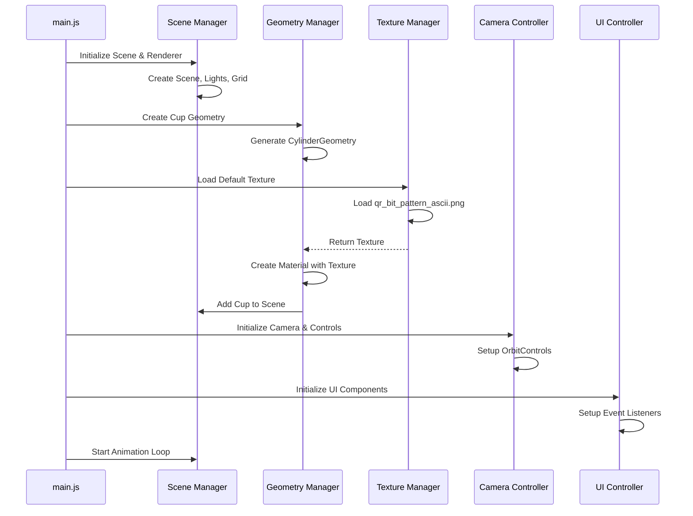
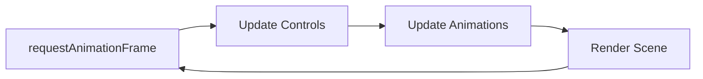

# 3D Cup Visualization - Technical Architecture Document

## 1. System Overview

The 3D Cup Visualization application is a web-based interactive tool that allows users to visualize custom images wrapped around a 3D cup model. Built with Three.js and Vite, the application provides real-time rendering, texture mapping, and interactive camera controls for an immersive user experience.

### Core Capabilities
- **3D Rendering**: Real-time WebGL rendering of a realistic cup geometry
- **Texture Mapping**: Dynamic image upload and wrapping around cylindrical surfaces
- **Interactive Controls**: Orbit, zoom, and pan camera controls for 360° viewing
- **User Interface**: Intuitive controls for image upload and customization
- **Default Content**: Pre-loaded QR code texture as demonstration

### Technology Stack
- **Three.js v0.160.0**: 3D graphics library
- **Vite v5.0.0**: Build tool and development server
- **Vanilla JavaScript**: ES6+ modules
- **HTML5/CSS3**: User interface and styling

---

## 2. Component Architecture

The application follows a modular architecture with clear separation of concerns:



### 2.1 Scene Manager
**Responsibility**: Manages the Three.js scene, renderer, and core 3D objects

**Key Functions**:
- Initialize and configure WebGL renderer
- Create and manage the scene graph
- Set up lighting (ambient + directional)
- Handle window resize events
- Manage animation loop
- Add/remove 3D objects from scene

**Dependencies**: Three.js core modules

### 2.2 Texture Manager
**Responsibility**: Handles all texture-related operations

**Key Functions**:
- Load textures from files or URLs
- Process uploaded images (validation, resizing if needed)
- Apply textures to materials
- Manage texture properties (wrapping, filtering, encoding)
- Handle texture disposal for memory management
- Provide default texture (QR code)

**Dependencies**: THREE.TextureLoader, File API

### 2.3 UI Controller
**Responsibility**: Manages user interface and user interactions

**Key Functions**:
- Handle file input for image uploads
- Create and manage control panel UI
- Dispatch events to other components
- Display loading states and error messages
- Manage UI visibility and state
- Handle drag-and-drop functionality

**Dependencies**: DOM API, Event system

### 2.4 Camera Controller
**Responsibility**: Manages camera positioning and user controls

**Key Functions**:
- Initialize PerspectiveCamera with optimal settings
- Configure OrbitControls for intuitive interaction
- Set camera constraints (zoom limits, rotation bounds)
- Handle camera animations and transitions
- Provide camera reset functionality

**Dependencies**: THREE.PerspectiveCamera, THREE.OrbitControls

### 2.5 Cup Geometry Manager
**Responsibility**: Creates and manages the 3D cup model

**Key Functions**:
- Generate CylinderGeometry with realistic proportions
- Configure UV mapping for proper texture wrapping
- Apply materials with appropriate properties
- Handle geometry updates if needed
- Manage cup positioning and orientation

**Dependencies**: THREE.CylinderGeometry, THREE.MeshStandardMaterial

---

## 3. Data Flow

### 3.1 Image Upload Flow



### 3.2 Application Initialization Flow



### 3.3 Render Loop Flow



---

## 4. Technical Specifications

### 4.1 Three.js Components

#### Scene Configuration
```javascript
Scene:
  - Background: new THREE.Color(0x1a1a1a)
  - Fog: Optional, for depth perception

Renderer:
  - Type: THREE.WebGLRenderer
  - Antialias: true
  - PixelRatio: Math.min(window.devicePixelRatio, 2)
  - ToneMapping: THREE.ACESFilmicToneMapping
  - OutputEncoding: THREE.sRGBEncoding
```

#### Camera Configuration
```javascript
PerspectiveCamera:
  - FOV: 50 degrees (more realistic than 75)
  - Aspect: window.innerWidth / window.innerHeight
  - Near: 0.1
  - Far: 1000
  - Initial Position: (0, 3, 8)
  - LookAt: (0, 0, 0)
```

#### Cup Geometry Parameters
```javascript
CylinderGeometry:
  - radiusTop: 1.2 (wider opening)
  - radiusBottom: 0.9 (narrower base)
  - height: 3.5 (realistic cup height)
  - radialSegments: 64 (smooth curves, good for textures)
  - heightSegments: 1 (sufficient for cylinder)
  - openEnded: false (closed top and bottom)
  - thetaStart: 0
  - thetaLength: Math.PI * 2
```

#### Material Configuration
```javascript
MeshStandardMaterial:
  - map: texture (the uploaded image)
  - metalness: 0.1 (slight metallic sheen)
  - roughness: 0.6 (matte finish like ceramic)
  - side: THREE.FrontSide
  - transparent: false
  - depthWrite: true
```

#### Lighting Setup
```javascript
AmbientLight:
  - Color: 0xffffff
  - Intensity: 0.6 (soft ambient illumination)

DirectionalLight:
  - Color: 0xffffff
  - Intensity: 0.8
  - Position: (5, 8, 5)
  - castShadow: true (optional, for realism)

SpotLight (optional):
  - For highlighting the cup
  - Position: (0, 10, 0)
  - Target: cup
  - Angle: Math.PI / 6
```

#### OrbitControls Configuration
```javascript
OrbitControls:
  - enableDamping: true
  - dampingFactor: 0.05
  - minDistance: 3
  - maxDistance: 15
  - minPolarAngle: 0
  - maxPolarAngle: Math.PI / 1.5 (prevent viewing from below)
  - enablePan: true
  - panSpeed: 0.8
  - rotateSpeed: 0.5
  - zoomSpeed: 0.8
  - target: (0, 0, 0)
```

#### Texture Configuration
```javascript
Texture:
  - wrapS: THREE.RepeatWrapping
  - wrapT: THREE.ClampToEdgeWrapping
  - repeat: (1, 1) (adjustable by user)
  - offset: (0, 0) (adjustable by user)
  - rotation: 0 (adjustable by user)
  - minFilter: THREE.LinearMipMapLinearFilter
  - magFilter: THREE.LinearFilter
  - encoding: THREE.sRGBEncoding
  - anisotropy: renderer.capabilities.getMaxAnisotropy()
```

### 4.2 UV Mapping Strategy

Three.js CylinderGeometry automatically generates UV coordinates, but understanding them is crucial:

**Cylinder UV Layout**:
- **U coordinate (horizontal)**: Wraps around the circumference (0 to 1 = 0° to 360°)
- **V coordinate (vertical)**: Maps from bottom to top (0 = bottom, 1 = top)
- **Top/Bottom caps**: Have radial UV mapping from center

**Texture Wrapping Behavior**:
1. **RepeatWrapping on U**: Allows texture to repeat horizontally around the cylinder
2. **ClampToEdgeWrapping on V**: Prevents vertical stretching at top/bottom
3. **Image Aspect Ratio**: Should be considered when mapping to avoid distortion

**Best Practices**:
- For QR codes: Use square images or adjust repeat values
- For logos: Center the image and use appropriate offset
- For patterns: Use seamless textures with RepeatWrapping
- For photos: Consider aspect ratio and use texture.repeat to adjust

**UV Coordinate Adjustment**:
```javascript
// Example: Adjust texture to fit properly
texture.repeat.set(1, height / circumference);
texture.offset.set(0, 0.1); // Slight vertical offset
texture.rotation = Math.PI / 2; // Rotate if needed
```

### 4.3 File Upload Specifications

**Supported Formats**:
- JPEG (.jpg, .jpeg)
- PNG (.png)
- WebP (.webp)
- GIF (.gif) - static only

**Validation Rules**:
- Maximum file size: 10MB
- Minimum dimensions: 100x100 pixels
- Maximum dimensions: 4096x4096 pixels
- File type validation via MIME type

**Processing Pipeline**:
1. Validate file type and size
2. Create FileReader instance
3. Read file as Data URL
4. Create Image element
5. Wait for image load
6. Create THREE.Texture from image
7. Configure texture properties
8. Apply to material
9. Dispose old texture

---

## 5. File Structure

### Current Structure (with issues)
```
cylinder/
├── index.html          (has duplication)
├── main.js             (has duplication)
├── styles.css          (has duplication)
├── package.json        (has duplication)
├── qr_bit_pattern_ascii.png
└── ARCHITECTURE.md     (this file)
```

### Proposed Refactored Structure
```
cylinder/
├── public/
│   └── qr_bit_pattern_ascii.png
├── src/
│   ├── main.js                    (Entry point)
│   ├── core/
│   │   ├── SceneManager.js        (Scene, renderer, animation loop)
│   │   ├── CameraController.js    (Camera and OrbitControls)
│   │   └── LightingSystem.js      (All lighting setup)
│   ├── components/
│   │   ├── CupGeometry.js         (Cup creation and management)
│   │   └── TextureManager.js      (Texture loading and processing)
│   ├── ui/
│   │   ├── UIController.js        (Main UI coordination)
│   │   ├── FileUploader.js        (File input handling)
│   │   └── ControlPanel.js        (UI controls)
│   ├── utils/
│   │   ├── imageProcessor.js      (Image validation and processing)
│   │   └── constants.js           (Configuration constants)
│   └── styles/
│       ├── main.css               (Base styles)
│       ├── controls.css           (UI control styles)
│       └── loading.css            (Loading indicator styles)
├── index.html
├── package.json
├── vite.config.js                 (Vite configuration)
├── ARCHITECTURE.md
└── README.md
```

### File Responsibilities

#### [`src/main.js`](src/main.js)
- Application entry point
- Initialize all managers and controllers
- Coordinate component interactions
- Handle global error catching
- Export public API if needed

#### [`src/core/SceneManager.js`](src/core/SceneManager.js)
- Create and configure THREE.Scene
- Initialize WebGLRenderer
- Set up scene background and fog
- Manage animation loop
- Handle window resize
- Add/remove objects from scene
- Provide scene access to other components

#### [`src/core/CameraController.js`](src/core/CameraController.js)
- Create PerspectiveCamera
- Initialize OrbitControls
- Configure control constraints
- Provide camera reset method
- Handle camera animations
- Export camera and controls instances

#### [`src/core/LightingSystem.js`](src/core/LightingSystem.js)
- Create ambient light
- Create directional light(s)
- Optional: Create spot lights
- Configure shadows
- Provide methods to adjust lighting
- Return light objects for scene addition

#### [`src/components/CupGeometry.js`](src/components/CupGeometry.js)
- Create CylinderGeometry with proper parameters
- Initialize MeshStandardMaterial
- Create and return Mesh
- Provide methods to update material
- Handle geometry disposal
- Expose cup mesh for manipulation

#### [`src/components/TextureManager.js`](src/components/TextureManager.js)
- Load default texture (QR code)
- Handle texture uploads
- Create THREE.Texture from images
- Configure texture properties
- Manage texture disposal
- Provide texture update callbacks
- Cache loaded textures

#### [`src/ui/UIController.js`](src/ui/UIController.js)
- Coordinate all UI components
- Initialize FileUploader and ControlPanel
- Handle UI state management
- Show/hide loading indicators
- Display error messages
- Manage UI event flow

#### [`src/ui/FileUploader.js`](src/ui/FileUploader.js)
- Create file input element
- Handle file selection events
- Implement drag-and-drop zone
- Validate file types and sizes
- Emit upload events
- Provide visual feedback

#### [`src/ui/ControlPanel.js`](src/ui/ControlPanel.js)
- Create control panel UI
- Add texture adjustment controls (repeat, offset, rotation)
- Add camera reset button
- Add animation toggle
- Handle control interactions
- Emit control change events

#### [`src/utils/imageProcessor.js`](src/utils/imageProcessor.js)
- Validate image files
- Check file size and dimensions
- Create Image elements from files
- Handle image loading promises
- Provide image manipulation utilities
- Error handling for invalid images

#### [`src/utils/constants.js`](src/utils/constants.js)
- Define all configuration constants
- Camera settings
- Geometry parameters
- Material properties
- File upload limits
- UI configuration
- Export as named constants

---

## 6. Implementation Strategy

### Phase 1: Code Cleanup and Refactoring
**Objective**: Remove duplication and establish clean foundation

**Steps**:
1. Remove duplicate code blocks from all files
2. Verify basic Three.js setup works correctly
3. Test that QR code image loads properly
4. Ensure development server runs without errors

**Validation**:
- No duplicate code in any file
- Application runs and displays basic cylinder
- No console errors

### Phase 2: Modular Architecture Setup
**Objective**: Restructure code into modular components

**Steps**:
1. Create new directory structure (src/, src/core/, src/components/, src/ui/, src/utils/)
2. Create SceneManager.js with scene and renderer logic
3. Create CameraController.js with camera setup
4. Create LightingSystem.js with lighting configuration
5. Update main.js to use new modules
6. Test that refactored code works identically to original

**Validation**:
- All modules export and import correctly
- Application functionality unchanged
- Code is more organized and maintainable

### Phase 3: Texture System Implementation
**Objective**: Implement texture loading and management

**Steps**:
1. Create TextureManager.js class
2. Implement default texture loading (QR code)
3. Configure texture properties (wrapping, filtering)
4. Update CupGeometry.js to accept and apply textures
5. Test texture appears correctly on cylinder
6. Verify UV mapping is correct

**Validation**:
- QR code texture loads and displays on cup
- Texture wraps around cylinder properly
- No distortion or stretching issues

### Phase 4: File Upload System
**Objective**: Enable user image uploads

**Steps**:
1. Create FileUploader.js component
2. Add file input element to HTML
3. Implement file validation logic
4. Create imageProcessor.js utilities
5. Connect file upload to TextureManager
6. Add loading states and error handling
7. Test with various image formats and sizes

**Validation**:
- Users can select and upload images
- Invalid files are rejected with clear messages
- Uploaded images appear on cup correctly
- Loading states provide feedback

### Phase 5: Interactive Controls
**Objective**: Add OrbitControls and camera interaction

**Steps**:
1. Import OrbitControls from three/examples/jsm/controls/OrbitControls
2. Initialize controls in CameraController.js
3. Configure control constraints and damping
4. Update animation loop to update controls
5. Test orbit, zoom, and pan functionality
6. Fine-tune control parameters for best UX

**Validation**:
- Users can rotate cup by dragging
- Zoom works with mouse wheel
- Pan works with right-click drag
- Controls feel smooth and responsive

### Phase 6: UI Control Panel
**Objective**: Add customization controls

**Steps**:
1. Create ControlPanel.js component
2. Design control panel UI in HTML/CSS
3. Add texture adjustment controls:
   - Repeat X/Y sliders
   - Offset X/Y sliders
   - Rotation slider
4. Add camera reset button
5. Add animation play/pause toggle
6. Connect controls to TextureManager and CameraController
7. Style control panel for good UX

**Validation**:
- All controls function correctly
- Changes update in real-time
- UI is intuitive and responsive
- Controls are properly labeled

### Phase 7: Enhanced Cup Geometry
**Objective**: Improve cup realism and proportions

**Steps**:
1. Update CylinderGeometry parameters for realistic cup shape
2. Adjust radialSegments for smooth texture mapping
3. Fine-tune material properties (metalness, roughness)
4. Add optional features (handle, rim detail)
5. Position cup optimally in scene
6. Test with various textures

**Validation**:
- Cup looks realistic and proportional
- Textures map cleanly without artifacts
- Material properties enhance appearance
- Cup is well-positioned in viewport

### Phase 8: Polish and Optimization
**Objective**: Enhance performance and user experience

**Steps**:
1. Implement texture disposal to prevent memory leaks
2. Add drag-and-drop file upload
3. Improve loading indicators
4. Add error boundaries and user feedback
5. Optimize render loop (only render when needed)
6. Add keyboard shortcuts
7. Implement responsive design
8. Test on multiple devices and browsers

**Validation**:
- No memory leaks during texture changes
- Smooth performance on target devices
- All features work across browsers
- User experience is polished

### Phase 9: Documentation and Testing
**Objective**: Complete project documentation

**Steps**:
1. Write comprehensive README.md
2. Add inline code comments
3. Create user guide
4. Document API for each module
5. Add JSDoc comments
6. Create example usage scenarios

**Validation**:
- Documentation is clear and complete
- Code is well-commented
- New developers can understand the codebase

---

## 7. Texture Mapping Strategy (Detailed)

### 7.1 Understanding Cylinder UV Mapping

Three.js CylinderGeometry generates UV coordinates automatically:

**Side Surface**:
- U (horizontal): Maps linearly around circumference (0 → 1 = 0° → 360°)
- V (vertical): Maps linearly from bottom to top (0 → 1)
- The texture wraps around the cylinder once by default

**Top and Bottom Caps**:
- UV coordinates are radial from center
- May cause distortion for non-radial patterns
- Often hidden or use different materials

### 7.2 Texture Configuration for Different Image Types

#### QR Codes (Square, High Contrast)
```javascript
texture.wrapS = THREE.RepeatWrapping;
texture.wrapT = THREE.ClampToEdgeWrapping;
texture.repeat.set(1, 1);
texture.minFilter = THREE.NearestFilter; // Sharp edges
texture.magFilter = THREE.NearestFilter;
```

#### Logos (Rectangular, Transparent)
```javascript
texture.wrapS = THREE.ClampToEdgeWrapping;
texture.wrapT = THREE.ClampToEdgeWrapping;
// Adjust repeat based on aspect ratio
const aspectRatio = image.width / image.height;
texture.repeat.set(1, aspectRatio);
texture.offset.set(0, (1 - aspectRatio) / 2); // Center vertically
```

#### Photos (Various Aspect Ratios)
```javascript
texture.wrapS = THREE.RepeatWrapping;
texture.wrapT = THREE.ClampToEdgeWrapping;
// Calculate optimal repeat to avoid distortion
const cupCircumference = 2 * Math.PI * cupRadius;
const cupHeight = 3.5;
const imageAspect = image.width / image.height;
const cupAspect = cupCircumference / cupHeight;
texture.repeat.set(1, cupAspect / imageAspect);
```

#### Seamless Patterns
```javascript
texture.wrapS = THREE.RepeatWrapping;
texture.wrapT = THREE.RepeatWrapping;
texture.repeat.set(3, 2); // Repeat multiple times
```

### 7.3 Handling Image Distortion

**Problem**: Images may appear stretched or compressed on the cylinder

**Solutions**:
1. **Aspect Ratio Correction**:
   - Calculate cup surface aspect ratio
   - Adjust texture.repeat to match
   - Use offset to center the image

2. **Pre-processing**:
   - Resize images to optimal dimensions
   - Create unwrapped texture maps
   - Add padding for seamless wrapping

3. **User Controls**:
   - Provide repeat sliders (X and Y)
   - Provide offset sliders for positioning
   - Provide rotation control
   - Show preview of adjustments

### 7.4 Advanced Texture Techniques

#### Multi-Material Approach
```javascript
// Different materials for body and caps
const materials = [
  new THREE.MeshStandardMaterial({ map: sideTexture }), // Side
  new THREE.MeshStandardMaterial({ map: topTexture }),  // Top
  new THREE.MeshStandardMaterial({ map: bottomTexture }) // Bottom
];
```

#### Normal Maps for Depth
```javascript
material.normalMap = normalTexture;
material.normalScale.set(0.5, 0.5);
```

#### Bump Maps for Surface Detail
```javascript
material.bumpMap = bumpTexture;
material.bumpScale = 0.1;
```

### 7.5 Texture Loading Best Practices

```javascript
class TextureManager {
  constructor() {
    this.loader = new THREE.TextureLoader();
    this.currentTexture = null;
  }

  loadTexture(url) {
    return new Promise((resolve, reject) => {
      this.loader.load(
        url,
        (texture) => {
          // Configure texture
          texture.wrapS = THREE.RepeatWrapping;
          texture.wrapT = THREE.ClampToEdgeWrapping;
          texture.encoding = THREE.sRGBEncoding;
          texture.anisotropy = this.renderer.capabilities.getMaxAnisotropy();
          
          // Dispose old texture
          if (this.currentTexture) {
            this.currentTexture.dispose();
          }
          
          this.currentTexture = texture;
          resolve(texture);
        },
        undefined,
        (error) => reject(error)
      );
    });
  }

  async uploadTexture(file) {
    // Validate file
    if (!this.isValidImage(file)) {
      throw new Error('Invalid image file');
    }

    // Create object URL
    const url = URL.createObjectURL(file);
    
    try {
      const texture = await this.loadTexture(url);
      return texture;
    } finally {
      // Clean up object URL
      URL.revokeObjectURL(url);
    }
  }

  isValidImage(file) {
    const validTypes = ['image/jpeg', 'image/png', 'image/webp'];
    const maxSize = 10 * 1024 * 1024; // 10MB
    
    return validTypes.includes(file.type) && file.size <= maxSize;
  }
}
```

---

## 8. Performance Considerations

### 8.1 Rendering Optimization
- Use `renderer.setPixelRatio(Math.min(window.devicePixelRatio, 2))` to limit pixel ratio
- Implement render-on-demand instead of continuous rendering when idle
- Use `renderer.info` to monitor draw calls and triangles

### 8.2 Texture Optimization
- Limit maximum texture size to 2048x2048 for compatibility
- Use mipmaps for better performance and quality
- Dispose textures when no longer needed
- Use texture compression if supported

### 8.3 Memory Management
- Dispose geometries and materials when removing objects
- Clear texture cache periodically
- Monitor memory usage in development
- Implement proper cleanup on component unmount

### 8.4 Animation Loop Optimization
```javascript
// Only render when controls change or animation is active
let needsRender = true;

controls.addEventListener('change', () => {
  needsRender = true;
});

function animate() {
  requestAnimationFrame(animate);
  
  if (controls.enabled) {
    controls.update();
  }
  
  if (needsRender) {
    renderer.render(scene, camera);
    needsRender = false;
  }
}
```

---

## 9. Error Handling Strategy

### 9.1 File Upload Errors
- Invalid file type → Show user-friendly message
- File too large → Suggest size limit
- Image load failure → Provide fallback texture
- Network errors → Retry mechanism

### 9.2 WebGL Errors
- Context loss → Attempt recovery
- Shader compilation errors → Log and fallback
- Out of memory → Reduce texture quality

### 9.3 User Feedback
- Loading states for async operations
- Progress indicators for large files
- Success confirmations
- Clear error messages with solutions

---

## 10. Future Enhancements

### Potential Features
1. **Multiple Texture Layers**: Overlay multiple images
2. **Color Adjustments**: Brightness, contrast, saturation controls
3. **Filters and Effects**: Apply image filters before mapping
4. **3D Text**: Add custom text to the cup
5. **Export Functionality**: Save rendered images or 3D models
6. **Preset Templates**: Pre-designed texture layouts
7. **Animation Options**: Rotate cup automatically, texture animations
8. **AR Preview**: View cup in augmented reality
9. **Batch Processing**: Upload multiple images
10. **Social Sharing**: Share designs on social media

### Scalability Considerations
- Support for different cup shapes (mug, tumbler, wine glass)
- Multiple object types (plates, bottles, etc.)
- User accounts and saved designs
- Backend integration for design storage
- Collaborative editing features

---

## 11. Development Guidelines

### Code Style
- Use ES6+ features (modules, arrow functions, async/await)
- Follow consistent naming conventions (camelCase for variables, PascalCase for classes)
- Keep functions small and focused (single responsibility)
- Add JSDoc comments for public APIs
- Use meaningful variable names

### Testing Strategy
- Manual testing in multiple browsers (Chrome, Firefox, Safari, Edge)
- Test on different devices (desktop, tablet, mobile)
- Test with various image types and sizes
- Performance testing with large textures
- Accessibility testing

### Version Control
- Commit frequently with clear messages
- Use feature branches for new functionality
- Tag releases with semantic versioning
- Maintain changelog

### Documentation
- Keep ARCHITECTURE.md updated with changes
- Document all public APIs
- Provide code examples
- Maintain README with setup instructions

---

## 12. Conclusion

This architecture provides a solid foundation for building a robust, maintainable, and extensible 3D cup visualization application. The modular design allows for easy testing, debugging, and future enhancements while maintaining clean separation of concerns.

### Key Architectural Decisions

1. **Modular Component Design**: Separates concerns and improves maintainability
2. **Event-Driven Communication**: Loose coupling between components
3. **Texture Manager Pattern**: Centralizes texture operations and memory management
4. **Progressive Enhancement**: Start with core features, add enhancements iteratively
5. **Performance-First Approach**: Optimize rendering and memory usage from the start

### Success Metrics

- Clean, maintainable codebase with no duplication
- Smooth 60 FPS rendering on target devices
- Intuitive user interface requiring no instructions
- Support for common image formats up to 10MB
- Proper texture mapping with minimal distortion
- Responsive design working on desktop and mobile

### Next Steps

1. Review and approve this architecture document
2. Begin Phase 1: Code cleanup and duplication removal
3. Proceed through implementation phases sequentially
4. Test thoroughly at each phase before moving forward
5. Iterate based on user feedback and testing results

---

**Document Version**: 1.0  
**Last Updated**: 2026-01-26  
**Author**: Technical Architecture Team  
**Status**: Ready for Review

## 1. System Overview

The 3D Cup Visualization application is a web-based interactive tool that allows users to visualize custom images wrapped around a 3D cup model. Built with Three.js and Vite, the application provides real-time rendering, texture mapping, and interactive camera controls for an immersive user experience.

### Core Capabilities
- **3D Rendering**: Real-time WebGL rendering of a realistic cup geometry
- **Texture Mapping**: Dynamic image upload and wrapping around cylindrical surfaces
- **Interactive Controls**: Orbit, zoom, and pan camera controls for 360° viewing
- **User Interface**: Intuitive controls for image upload and customization
- **Default Content**: Pre-loaded QR code texture as demonstration

### Technology Stack
- **Three.js v0.160.0**: 3D graphics library
- **Vite v5.0.0**: Build tool and development server
- **Vanilla JavaScript**: ES6+ modules
- **HTML5/CSS3**: User interface and styling

---

## 2. Component Architecture

The application follows a modular architecture with clear separation of concerns:


### 2.1 Scene Manager
**Responsibility**: Manages the Three.js scene, renderer, and core 3D objects

**Key Functions**:
- Initialize and configure WebGL renderer
- Create and manage the scene graph
- Set up lighting (ambient + directional)
- Handle window resize events
- Manage animation loop
- Add/remove 3D objects from scene

**Dependencies**: Three.js core modules

### 2.2 Texture Manager
**Responsibility**: Handles all texture-related operations

**Key Functions**:
- Load textures from files or URLs
- Process uploaded images (validation, resizing if needed)
- Apply textures to materials
- Manage texture properties (wrapping, filtering, encoding)
- Handle texture disposal for memory management
- Provide default texture (QR code)

**Dependencies**: THREE.TextureLoader, File API

### 2.3 UI Controller
**Responsibility**: Manages user interface and user interactions

**Key Functions**:
- Handle file input for image uploads
- Create and manage control panel UI
- Dispatch events to other components
- Display loading states and error messages
- Manage UI visibility and state
- Handle drag-and-drop functionality

**Dependencies**: DOM API, Event system

### 2.4 Camera Controller
**Responsibility**: Manages camera positioning and user controls

**Key Functions**:
- Initialize PerspectiveCamera with optimal settings
- Configure OrbitControls for intuitive interaction
- Set camera constraints (zoom limits, rotation bounds)
- Handle camera animations and transitions
- Provide camera reset functionality

**Dependencies**: THREE.PerspectiveCamera, THREE.OrbitControls

### 2.5 Cup Geometry Manager
**Responsibility**: Creates and manages the 3D cup model

**Key Functions**:
- Generate CylinderGeometry with realistic proportions
- Configure UV mapping for proper texture wrapping
- Apply materials with appropriate properties
- Handle geometry updates if needed
- Manage cup positioning and orientation

**Dependencies**: THREE.CylinderGeometry, THREE.MeshStandardMaterial

---

## 3. Data Flow

### 3.1 Image Upload Flow


### 3.2 Application Initialization Flow


### 3.3 Render Loop Flow


---

## 4. Technical Specifications

### 4.1 Three.js Components

#### Scene Configuration
```javascript
Scene:
  - Background: new THREE.Color(0x1a1a1a)
  - Fog: Optional, for depth perception

Renderer:
  - Type: THREE.WebGLRenderer
  - Antialias: true
  - PixelRatio: Math.min(window.devicePixelRatio, 2)
  - ToneMapping: THREE.ACESFilmicToneMapping
  - OutputEncoding: THREE.sRGBEncoding
```

#### Camera Configuration
```javascript
PerspectiveCamera:
  - FOV: 50 degrees (more realistic than 75)
  - Aspect: window.innerWidth / window.innerHeight
  - Near: 0.1
  - Far: 1000
  - Initial Position: (0, 3, 8)
  - LookAt: (0, 0, 0)
```

#### Cup Geometry Parameters
```javascript
CylinderGeometry:
  - radiusTop: 1.2 (wider opening)
  - radiusBottom: 0.9 (narrower base)
  - height: 3.5 (realistic cup height)
  - radialSegments: 64 (smooth curves, good for textures)
  - heightSegments: 1 (sufficient for cylinder)
  - openEnded: false (closed top and bottom)
  - thetaStart: 0
  - thetaLength: Math.PI * 2
```

#### Material Configuration
```javascript
MeshStandardMaterial:
  - map: texture (the uploaded image)
  - metalness: 0.1 (slight metallic sheen)
  - roughness: 0.6 (matte finish like ceramic)
  - side: THREE.FrontSide
  - transparent: false
  - depthWrite: true
```

#### Lighting Setup
```javascript
AmbientLight:
  - Color: 0xffffff
  - Intensity: 0.6 (soft ambient illumination)

DirectionalLight:
  - Color: 0xffffff
  - Intensity: 0.8
  - Position: (5, 8, 5)
  - castShadow: true (optional, for realism)

SpotLight (optional):
  - For highlighting the cup
  - Position: (0, 10, 0)
  - Target: cup
  - Angle: Math.PI / 6
```

#### OrbitControls Configuration
```javascript
OrbitControls:
  - enableDamping: true
  - dampingFactor: 0.05
  - minDistance: 3
  - maxDistance: 15
  - minPolarAngle: 0
  - maxPolarAngle: Math.PI / 1.5 (prevent viewing from below)
  - enablePan: true
  - panSpeed: 0.8
  - rotateSpeed: 0.5
  - zoomSpeed: 0.8
  - target: (0, 0, 0)
```

#### Texture Configuration
```javascript
Texture:
  - wrapS: THREE.RepeatWrapping
  - wrapT: THREE.ClampToEdgeWrapping
  - repeat: (1, 1) (adjustable by user)
  - offset: (0, 0) (adjustable by user)
  - rotation: 0 (adjustable by user)
  - minFilter: THREE.LinearMipMapLinearFilter
  - magFilter: THREE.LinearFilter
  - encoding: THREE.sRGBEncoding
  - anisotropy: renderer.capabilities.getMaxAnisotropy()
```

### 4.2 UV Mapping Strategy

Three.js CylinderGeometry automatically generates UV coordinates, but understanding them is crucial:

**Cylinder UV Layout**:
- **U coordinate (horizontal)**: Wraps around the circumference (0 to 1 = 0° to 360°)
- **V coordinate (vertical)**: Maps from bottom to top (0 = bottom, 1 = top)
- **Top/Bottom caps**: Have radial UV mapping from center

**Texture Wrapping Behavior**:
1. **RepeatWrapping on U**: Allows texture to repeat horizontally around the cylinder
2. **ClampToEdgeWrapping on V**: Prevents vertical stretching at top/bottom
3. **Image Aspect Ratio**: Should be considered when mapping to avoid distortion

**Best Practices**:
- For QR codes: Use square images or adjust repeat values
- For logos: Center the image and use appropriate offset
- For patterns: Use seamless textures with RepeatWrapping
- For photos: Consider aspect ratio and use texture.repeat to adjust

**UV Coordinate Adjustment**:
```javascript
// Example: Adjust texture to fit properly
texture.repeat.set(1, height / circumference);
texture.offset.set(0, 0.1); // Slight vertical offset
texture.rotation = Math.PI / 2; // Rotate if needed
```

### 4.3 File Upload Specifications

**Supported Formats**:
- JPEG (.jpg, .jpeg)
- PNG (.png)
- WebP (.webp)
- GIF (.gif) - static only

**Validation Rules**:
- Maximum file size: 10MB
- Minimum dimensions: 100x100 pixels
- Maximum dimensions: 4096x4096 pixels
- File type validation via MIME type

**Processing Pipeline**:
1. Validate file type and size
2. Create FileReader instance
3. Read file as Data URL
4. Create Image element
5. Wait for image load
6. Create THREE.Texture from image
7. Configure texture properties
8. Apply to material
9. Dispose old texture

---

## 5. File Structure

### Current Structure (with issues)
```
cylinder/
├── index.html          (has duplication)
├── main.js             (has duplication)
├── styles.css          (has duplication)
├── package.json        (has duplication)
├── qr_bit_pattern_ascii.png
└── ARCHITECTURE.md     (this file)
```

### Proposed Refactored Structure
```
cylinder/
├── public/
│   └── qr_bit_pattern_ascii.png
├── src/
│   ├── main.js                    (Entry point)
│   ├── core/
│   │   ├── SceneManager.js        (Scene, renderer, animation loop)
│   │   ├── CameraController.js    (Camera and OrbitControls)
│   │   └── LightingSystem.js      (All lighting setup)
│   ├── components/
│   │   ├── CupGeometry.js         (Cup creation and management)
│   │   └── TextureManager.js      (Texture loading and processing)
│   ├── ui/
│   │   ├── UIController.js        (Main UI coordination)
│   │   ├── FileUploader.js        (File input handling)
│   │   └── ControlPanel.js        (UI controls)
│   ├── utils/
│   │   ├── imageProcessor.js      (Image validation and processing)
│   │   └── constants.js           (Configuration constants)
│   └── styles/
│       ├── main.css               (Base styles)
│       ├── controls.css           (UI control styles)
│       └── loading.css            (Loading indicator styles)
├── index.html
├── package.json
├── vite.config.js                 (Vite configuration)
├── ARCHITECTURE.md
└── README.md
```

### File Responsibilities

#### [`src/main.js`](src/main.js)
- Application entry point
- Initialize all managers and controllers
- Coordinate component interactions
- Handle global error catching
- Export public API if needed

#### [`src/core/SceneManager.js`](src/core/SceneManager.js)
- Create and configure THREE.Scene
- Initialize WebGLRenderer
- Set up scene background and fog
- Manage animation loop
- Handle window resize
- Add/remove objects from scene
- Provide scene access to other components

#### [`src/core/CameraController.js`](src/core/CameraController.js)
- Create PerspectiveCamera
- Initialize OrbitControls
- Configure control constraints
- Provide camera reset method
- Handle camera animations
- Export camera and controls instances

#### [`src/core/LightingSystem.js`](src/core/LightingSystem.js)
- Create ambient light
- Create directional light(s)
- Optional: Create spot lights
- Configure shadows
- Provide methods to adjust lighting
- Return light objects for scene addition

#### [`src/components/CupGeometry.js`](src/components/CupGeometry.js)
- Create CylinderGeometry with proper parameters
- Initialize MeshStandardMaterial
- Create and return Mesh
- Provide methods to update material
- Handle geometry disposal
- Expose cup mesh for manipulation

#### [`src/components/TextureManager.js`](src/components/TextureManager.js)
- Load default texture (QR code)
- Handle texture uploads
- Create THREE.Texture from images
- Configure texture properties
- Manage texture disposal
- Provide texture update callbacks
- Cache loaded textures

#### [`src/ui/UIController.js`](src/ui/UIController.js)
- Coordinate all UI components
- Initialize FileUploader and ControlPanel
- Handle UI state management
- Show/hide loading indicators
- Display error messages
- Manage UI event flow

#### [`src/ui/FileUploader.js`](src/ui/FileUploader.js)
- Create file input element
- Handle file selection events
- Implement drag-and-drop zone
- Validate file types and sizes
- Emit upload events
- Provide visual feedback

#### [`src/ui/ControlPanel.js`](src/ui/ControlPanel.js)
- Create control panel UI
- Add texture adjustment controls (repeat, offset, rotation)
- Add camera reset button
- Add animation toggle
- Handle control interactions
- Emit control change events

#### [`src/utils/imageProcessor.js`](src/utils/imageProcessor.js)
- Validate image files
- Check file size and dimensions
- Create Image elements from files
- Handle image loading promises
- Provide image manipulation utilities
- Error handling for invalid images

#### [`src/utils/constants.js`](src/utils/constants.js)
- Define all configuration constants
- Camera settings
- Geometry parameters
- Material properties
- File upload limits
- UI configuration
- Export as named constants

---

## 6. Implementation Strategy

### Phase 1: Code Cleanup and Refactoring
**Objective**: Remove duplication and establish clean foundation

**Steps**:
1. Remove duplicate code blocks from all files
2. Verify basic Three.js setup works correctly
3. Test that QR code image loads properly
4. Ensure development server runs without errors

**Validation**:
- No duplicate code in any file
- Application runs and displays basic cylinder
- No console errors

### Phase 2: Modular Architecture Setup
**Objective**: Restructure code into modular components

**Steps**:
1. Create new directory structure (src/, src/core/, src/components/, src/ui/, src/utils/)
2. Create SceneManager.js with scene and renderer logic
3. Create CameraController.js with camera setup
4. Create LightingSystem.js with lighting configuration
5. Update main.js to use new modules
6. Test that refactored code works identically to original

**Validation**:
- All modules export and import correctly
- Application functionality unchanged
- Code is more organized and maintainable

### Phase 3: Texture System Implementation
**Objective**: Implement texture loading and management

**Steps**:
1. Create TextureManager.js class
2. Implement default texture loading (QR code)
3. Configure texture properties (wrapping, filtering)
4. Update CupGeometry.js to accept and apply textures
5. Test texture appears correctly on cylinder
6. Verify UV mapping is correct

**Validation**:
- QR code texture loads and displays on cup
- Texture wraps around cylinder properly
- No distortion or stretching issues

### Phase 4: File Upload System
**Objective**: Enable user image uploads

**Steps**:
1. Create FileUploader.js component
2. Add file input element to HTML
3. Implement file validation logic
4. Create imageProcessor.js utilities
5. Connect file upload to TextureManager
6. Add loading states and error handling
7. Test with various image formats and sizes

**Validation**:
- Users can select and upload images
- Invalid files are rejected with clear messages
- Uploaded images appear on cup correctly
- Loading states provide feedback

### Phase 5: Interactive Controls
**Objective**: Add OrbitControls and camera interaction

**Steps**:
1. Import OrbitControls from three/examples/jsm/controls/OrbitControls
2. Initialize controls in CameraController.js
3. Configure control constraints and damping
4. Update animation loop to update controls
5. Test orbit, zoom, and pan functionality
6. Fine-tune control parameters for best UX

**Validation**:
- Users can rotate cup by dragging
- Zoom works with mouse wheel
- Pan works with right-click drag
- Controls feel smooth and responsive

### Phase 6: UI Control Panel
**Objective**: Add customization controls

**Steps**:
1. Create ControlPanel.js component
2. Design control panel UI in HTML/CSS
3. Add texture adjustment controls:
   - Repeat X/Y sliders
   - Offset X/Y sliders
   - Rotation slider
4. Add camera reset button
5. Add animation play/pause toggle
6. Connect controls to TextureManager and CameraController
7. Style control panel for good UX

**Validation**:
- All controls function correctly
- Changes update in real-time
- UI is intuitive and responsive
- Controls are properly labeled

### Phase 7: Enhanced Cup Geometry
**Objective**: Improve cup realism and proportions

**Steps**:
1. Update CylinderGeometry parameters for realistic cup shape
2. Adjust radialSegments for smooth texture mapping
3. Fine-tune material properties (metalness, roughness)
4. Add optional features (handle, rim detail)
5. Position cup optimally in scene
6. Test with various textures

**Validation**:
- Cup looks realistic and proportional
- Textures map cleanly without artifacts
- Material properties enhance appearance
- Cup is well-positioned in viewport

### Phase 8: Polish and Optimization
**Objective**: Enhance performance and user experience

**Steps**:
1. Implement texture disposal to prevent memory leaks
2. Add drag-and-drop file upload
3. Improve loading indicators
4. Add error boundaries and user feedback
5. Optimize render loop (only render when needed)
6. Add keyboard shortcuts
7. Implement responsive design
8. Test on multiple devices and browsers

**Validation**:
- No memory leaks during texture changes
- Smooth performance on target devices
- All features work across browsers
- User experience is polished

### Phase 9: Documentation and Testing
**Objective**: Complete project documentation

**Steps**:
1. Write comprehensive README.md
2. Add inline code comments
3. Create user guide
4. Document API for each module
5. Add JSDoc comments
6. Create example usage scenarios

**Validation**:
- Documentation is clear and complete
- Code is well-commented
- New developers can understand the codebase

---

## 7. Texture Mapping Strategy (Detailed)

### 7.1 Understanding Cylinder UV Mapping

Three.js CylinderGeometry generates UV coordinates automatically:

**Side Surface**:
- U (horizontal): Maps linearly around circumference (0 → 1 = 0° → 360°)
- V (vertical): Maps linearly from bottom to top (0 → 1)
- The texture wraps around the cylinder once by default

**Top and Bottom Caps**:
- UV coordinates are radial from center
- May cause distortion for non-radial patterns
- Often hidden or use different materials

### 7.2 Texture Configuration for Different Image Types

#### QR Codes (Square, High Contrast)
```javascript
texture.wrapS = THREE.RepeatWrapping;
texture.wrapT = THREE.ClampToEdgeWrapping;
texture.repeat.set(1, 1);
texture.minFilter = THREE.NearestFilter; // Sharp edges
texture.magFilter = THREE.NearestFilter;
```

#### Logos (Rectangular, Transparent)
```javascript
texture.wrapS = THREE.ClampToEdgeWrapping;
texture.wrapT = THREE.ClampToEdgeWrapping;
// Adjust repeat based on aspect ratio
const aspectRatio = image.width / image.height;
texture.repeat.set(1, aspectRatio);
texture.offset.set(0, (1 - aspectRatio) / 2); // Center vertically
```

#### Photos (Various Aspect Ratios)
```javascript
texture.wrapS = THREE.RepeatWrapping;
texture.wrapT = THREE.ClampToEdgeWrapping;
// Calculate optimal repeat to avoid distortion
const cupCircumference = 2 * Math.PI * cupRadius;
const cupHeight = 3.5;
const imageAspect = image.width / image.height;
const cupAspect = cupCircumference / cupHeight;
texture.repeat.set(1, cupAspect / imageAspect);
```

#### Seamless Patterns
```javascript
texture.wrapS = THREE.RepeatWrapping;
texture.wrapT = THREE.RepeatWrapping;
texture.repeat.set(3, 2); // Repeat multiple times
```

### 7.3 Handling Image Distortion

**Problem**: Images may appear stretched or compressed on the cylinder

**Solutions**:
1. **Aspect Ratio Correction**:
   - Calculate cup surface aspect ratio
   - Adjust texture.repeat to match
   - Use offset to center the image

2. **Pre-processing**:
   - Resize images to optimal dimensions
   - Create unwrapped texture maps
   - Add padding for seamless wrapping

3. **User Controls**:
   - Provide repeat sliders (X and Y)
   - Provide offset sliders for positioning
   - Provide rotation control
   - Show preview of adjustments

### 7.4 Advanced Texture Techniques

#### Multi-Material Approach
```javascript
// Different materials for body and caps
const materials = [
  new THREE.MeshStandardMaterial({ map: sideTexture }), // Side
  new THREE.MeshStandardMaterial({ map: topTexture }),  // Top
  new THREE.MeshStandardMaterial({ map: bottomTexture }) // Bottom
];
```

#### Normal Maps for Depth
```javascript
material.normalMap = normalTexture;
material.normalScale.set(0.5, 0.5);
```

#### Bump Maps for Surface Detail
```javascript
material.bumpMap = bumpTexture;
material.bumpScale = 0.1;
```

### 7.5 Texture Loading Best Practices

```javascript
class TextureManager {
  constructor() {
    this.loader = new THREE.TextureLoader();
    this.currentTexture = null;
  }

  loadTexture(url) {
    return new Promise((resolve, reject) => {
      this.loader.load(
        url,
        (texture) => {
          // Configure texture
          texture.wrapS = THREE.RepeatWrapping;
          texture.wrapT = THREE.ClampToEdgeWrapping;
          texture.encoding = THREE.sRGBEncoding;
          texture.anisotropy = this.renderer.capabilities.getMaxAnisotropy();
          
          // Dispose old texture
          if (this.currentTexture) {
            this.currentTexture.dispose();
          }
          
          this.currentTexture = texture;
          resolve(texture);
        },
        undefined,
        (error) => reject(error)
      );
    });
  }

  async uploadTexture(file) {
    // Validate file
    if (!this.isValidImage(file)) {
      throw new Error('Invalid image file');
    }

    // Create object URL
    const url = URL.createObjectURL(file);
    
    try {
      const texture = await this.loadTexture(url);
      return texture;
    } finally {
      // Clean up object URL
      URL.revokeObjectURL(url);
    }
  }

  isValidImage(file) {
    const validTypes = ['image/jpeg', 'image/png', 'image/webp'];
    const maxSize = 10 * 1024 * 1024; // 10MB
    
    return validTypes.includes(file.type) && file.size <= maxSize;
  }
}
```

---

## 8. Performance Considerations

### 8.1 Rendering Optimization
- Use `renderer.setPixelRatio(Math.min(window.devicePixelRatio, 2))` to limit pixel ratio
- Implement render-on-demand instead of continuous rendering when idle
- Use `renderer.info` to monitor draw calls and triangles

### 8.2 Texture Optimization
- Limit maximum texture size to 2048x2048 for compatibility
- Use mipmaps for better performance and quality
- Dispose textures when no longer needed
- Use texture compression if supported

### 8.3 Memory Management
- Dispose geometries and materials when removing objects
- Clear texture cache periodically
- Monitor memory usage in development
- Implement proper cleanup on component unmount

### 8.4 Animation Loop Optimization
```javascript
// Only render when controls change or animation is active
let needsRender = true;

controls.addEventListener('change', () => {
  needsRender = true;
});

function animate() {
  requestAnimationFrame(animate);
  
  if (controls.enabled) {
    controls.update();
  }
  
  if (needsRender) {
    renderer.render(scene, camera);
    needsRender = false;
  }
}
```

---

## 9. Error Handling Strategy

### 9.1 File Upload Errors
- Invalid file type → Show user-friendly message
- File too large → Suggest size limit
- Image load failure → Provide fallback texture
- Network errors → Retry mechanism

### 9.2 WebGL Errors
- Context loss → Attempt recovery
- Shader compilation errors → Log and fallback
- Out of memory → Reduce texture quality

### 9.3 User Feedback
- Loading states for async operations
- Progress indicators for large files
- Success confirmations
- Clear error messages with solutions

---

## 10. Future Enhancements

### Potential Features
1. **Multiple Texture Layers**: Overlay multiple images
2. **Color Adjustments**: Brightness, contrast, saturation controls
3. **Filters and Effects**: Apply image filters before mapping
4. **3D Text**: Add custom text to the cup
5. **Export Functionality**: Save rendered images or 3D models
6. **Preset Templates**: Pre-designed texture layouts
7. **Animation Options**: Rotate cup automatically, texture animations
8. **AR Preview**: View cup in augmented reality
9. **Batch Processing**: Upload multiple images
10. **Social Sharing**: Share designs on social media

### Scalability Considerations
- Support for different cup shapes (mug, tumbler, wine glass)
- Multiple object types (plates, bottles, etc.)
- User accounts and saved designs
- Backend integration for design storage
- Collaborative editing features

---

## 11. Development Guidelines

### Code Style
- Use ES6+ features (modules, arrow functions, async/await)
- Follow consistent naming conventions (camelCase for variables, PascalCase for classes)
- Keep functions small and focused (single responsibility)
- Add JSDoc comments for public APIs
- Use meaningful variable names

### Testing Strategy
- Manual testing in multiple browsers (Chrome, Firefox, Safari, Edge)
- Test on different devices (desktop, tablet, mobile)
- Test with various image types and sizes
- Performance testing with large textures
- Accessibility testing

### Version Control
- Commit frequently with clear messages
- Use feature branches for new functionality
- Tag releases with semantic versioning
- Maintain changelog

### Documentation
- Keep ARCHITECTURE.md updated with changes
- Document all public APIs
- Provide code examples
- Maintain README with setup instructions

---

## 12. Conclusion

This architecture provides a solid foundation for building a robust, maintainable, and extensible 3D cup visualization application. The modular design allows for easy testing, debugging, and future enhancements while maintaining clean separation of concerns.

### Key Architectural Decisions

1. **Modular Component Design**: Separates concerns and improves maintainability
2. **Event-Driven Communication**: Loose coupling between components
3. **Texture Manager Pattern**: Centralizes texture operations and memory management
4. **Progressive Enhancement**: Start with core features, add enhancements iteratively
5. **Performance-First Approach**: Optimize rendering and memory usage from the start

### Success Metrics

- Clean, maintainable codebase with no duplication
- Smooth 60 FPS rendering on target devices
- Intuitive user interface requiring no instructions
- Support for common image formats up to 10MB
- Proper texture mapping with minimal distortion
- Responsive design working on desktop and mobile

### Next Steps

1. Review and approve this architecture document
2. Begin Phase 1: Code cleanup and duplication removal
3. Proceed through implementation phases sequentially
4. Test thoroughly at each phase before moving forward
5. Iterate based on user feedback and testing results

---

**Document Version**: 1.0  
**Last Updated**: 2026-01-26  
**Author**: Technical Architecture Team  
**Status**: Ready for Review

## 1. System Overview

The 3D Cup Visualization application is a web-based interactive tool that allows users to visualize custom images wrapped around a 3D cup model. Built with Three.js and Vite, the application provides real-time rendering, texture mapping, and interactive camera controls for an immersive user experience.

### Core Capabilities
- **3D Rendering**: Real-time WebGL rendering of a realistic cup geometry
- **Texture Mapping**: Dynamic image upload and wrapping around cylindrical surfaces
- **Interactive Controls**: Orbit, zoom, and pan camera controls for 360° viewing
- **User Interface**: Intuitive controls for image upload and customization
- **Default Content**: Pre-loaded QR code texture as demonstration

### Technology Stack
- **Three.js v0.160.0**: 3D graphics library
- **Vite v5.0.0**: Build tool and development server
- **Vanilla JavaScript**: ES6+ modules
- **HTML5/CSS3**: User interface and styling

---

## 2. Component Architecture

The application follows a modular architecture with clear separation of concerns:


### 2.1 Scene Manager
**Responsibility**: Manages the Three.js scene, renderer, and core 3D objects

**Key Functions**:
- Initialize and configure WebGL renderer
- Create and manage the scene graph
- Set up lighting (ambient + directional)
- Handle window resize events
- Manage animation loop
- Add/remove 3D objects from scene

**Dependencies**: Three.js core modules

### 2.2 Texture Manager
**Responsibility**: Handles all texture-related operations

**Key Functions**:
- Load textures from files or URLs
- Process uploaded images (validation, resizing if needed)
- Apply textures to materials
- Manage texture properties (wrapping, filtering, encoding)
- Handle texture disposal for memory management
- Provide default texture (QR code)

**Dependencies**: THREE.TextureLoader, File API

### 2.3 UI Controller
**Responsibility**: Manages user interface and user interactions

**Key Functions**:
- Handle file input for image uploads
- Create and manage control panel UI
- Dispatch events to other components
- Display loading states and error messages
- Manage UI visibility and state
- Handle drag-and-drop functionality

**Dependencies**: DOM API, Event system

### 2.4 Camera Controller
**Responsibility**: Manages camera positioning and user controls

**Key Functions**:
- Initialize PerspectiveCamera with optimal settings
- Configure OrbitControls for intuitive interaction
- Set camera constraints (zoom limits, rotation bounds)
- Handle camera animations and transitions
- Provide camera reset functionality

**Dependencies**: THREE.PerspectiveCamera, THREE.OrbitControls

### 2.5 Cup Geometry Manager
**Responsibility**: Creates and manages the 3D cup model

**Key Functions**:
- Generate CylinderGeometry with realistic proportions
- Configure UV mapping for proper texture wrapping
- Apply materials with appropriate properties
- Handle geometry updates if needed
- Manage cup positioning and orientation

**Dependencies**: THREE.CylinderGeometry, THREE.MeshStandardMaterial

---

## 3. Data Flow

### 3.1 Image Upload Flow


### 3.2 Application Initialization Flow


### 3.3 Render Loop Flow


---

## 4. Technical Specifications

### 4.1 Three.js Components

#### Scene Configuration
```javascript
Scene:
  - Background: new THREE.Color(0x1a1a1a)
  - Fog: Optional, for depth perception

Renderer:
  - Type: THREE.WebGLRenderer
  - Antialias: true
  - PixelRatio: Math.min(window.devicePixelRatio, 2)
  - ToneMapping: THREE.ACESFilmicToneMapping
  - OutputEncoding: THREE.sRGBEncoding
```

#### Camera Configuration
```javascript
PerspectiveCamera:
  - FOV: 50 degrees (more realistic than 75)
  - Aspect: window.innerWidth / window.innerHeight
  - Near: 0.1
  - Far: 1000
  - Initial Position: (0, 3, 8)
  - LookAt: (0, 0, 0)
```

#### Cup Geometry Parameters
```javascript
CylinderGeometry:
  - radiusTop: 1.2 (wider opening)
  - radiusBottom: 0.9 (narrower base)
  - height: 3.5 (realistic cup height)
  - radialSegments: 64 (smooth curves, good for textures)
  - heightSegments: 1 (sufficient for cylinder)
  - openEnded: false (closed top and bottom)
  - thetaStart: 0
  - thetaLength: Math.PI * 2
```

#### Material Configuration
```javascript
MeshStandardMaterial:
  - map: texture (the uploaded image)
  - metalness: 0.1 (slight metallic sheen)
  - roughness: 0.6 (matte finish like ceramic)
  - side: THREE.FrontSide
  - transparent: false
  - depthWrite: true
```

#### Lighting Setup
```javascript
AmbientLight:
  - Color: 0xffffff
  - Intensity: 0.6 (soft ambient illumination)

DirectionalLight:
  - Color: 0xffffff
  - Intensity: 0.8
  - Position: (5, 8, 5)
  - castShadow: true (optional, for realism)

SpotLight (optional):
  - For highlighting the cup
  - Position: (0, 10, 0)
  - Target: cup
  - Angle: Math.PI / 6
```

#### OrbitControls Configuration
```javascript
OrbitControls:
  - enableDamping: true
  - dampingFactor: 0.05
  - minDistance: 3
  - maxDistance: 15
  - minPolarAngle: 0
  - maxPolarAngle: Math.PI / 1.5 (prevent viewing from below)
  - enablePan: true
  - panSpeed: 0.8
  - rotateSpeed: 0.5
  - zoomSpeed: 0.8
  - target: (0, 0, 0)
```

#### Texture Configuration
```javascript
Texture:
  - wrapS: THREE.RepeatWrapping
  - wrapT: THREE.ClampToEdgeWrapping
  - repeat: (1, 1) (adjustable by user)
  - offset: (0, 0) (adjustable by user)
  - rotation: 0 (adjustable by user)
  - minFilter: THREE.LinearMipMapLinearFilter
  - magFilter: THREE.LinearFilter
  - encoding: THREE.sRGBEncoding
  - anisotropy: renderer.capabilities.getMaxAnisotropy()
```

### 4.2 UV Mapping Strategy

Three.js CylinderGeometry automatically generates UV coordinates, but understanding them is crucial:

**Cylinder UV Layout**:
- **U coordinate (horizontal)**: Wraps around the circumference (0 to 1 = 0° to 360°)
- **V coordinate (vertical)**: Maps from bottom to top (0 = bottom, 1 = top)
- **Top/Bottom caps**: Have radial UV mapping from center

**Texture Wrapping Behavior**:
1. **RepeatWrapping on U**: Allows texture to repeat horizontally around the cylinder
2. **ClampToEdgeWrapping on V**: Prevents vertical stretching at top/bottom
3. **Image Aspect Ratio**: Should be considered when mapping to avoid distortion

**Best Practices**:
- For QR codes: Use square images or adjust repeat values
- For logos: Center the image and use appropriate offset
- For patterns: Use seamless textures with RepeatWrapping
- For photos: Consider aspect ratio and use texture.repeat to adjust

**UV Coordinate Adjustment**:
```javascript
// Example: Adjust texture to fit properly
texture.repeat.set(1, height / circumference);
texture.offset.set(0, 0.1); // Slight vertical offset
texture.rotation = Math.PI / 2; // Rotate if needed
```

### 4.3 File Upload Specifications

**Supported Formats**:
- JPEG (.jpg, .jpeg)
- PNG (.png)
- WebP (.webp)
- GIF (.gif) - static only

**Validation Rules**:
- Maximum file size: 10MB
- Minimum dimensions: 100x100 pixels
- Maximum dimensions: 4096x4096 pixels
- File type validation via MIME type

**Processing Pipeline**:
1. Validate file type and size
2. Create FileReader instance
3. Read file as Data URL
4. Create Image element
5. Wait for image load
6. Create THREE.Texture from image
7. Configure texture properties
8. Apply to material
9. Dispose old texture

---

## 5. File Structure

### Current Structure (with issues)
```
cylinder/
├── index.html          (has duplication)
├── main.js             (has duplication)
├── styles.css          (has duplication)
├── package.json        (has duplication)
├── qr_bit_pattern_ascii.png
└── ARCHITECTURE.md     (this file)
```

### Proposed Refactored Structure
```
cylinder/
├── public/
│   └── qr_bit_pattern_ascii.png
├── src/
│   ├── main.js                    (Entry point)
│   ├── core/
│   │   ├── SceneManager.js        (Scene, renderer, animation loop)
│   │   ├── CameraController.js    (Camera and OrbitControls)
│   │   └── LightingSystem.js      (All lighting setup)
│   ├── components/
│   │   ├── CupGeometry.js         (Cup creation and management)
│   │   └── TextureManager.js      (Texture loading and processing)
│   ├── ui/
│   │   ├── UIController.js        (Main UI coordination)
│   │   ├── FileUploader.js        (File input handling)
│   │   └── ControlPanel.js        (UI controls)
│   ├── utils/
│   │   ├── imageProcessor.js      (Image validation and processing)
│   │   └── constants.js           (Configuration constants)
│   └── styles/
│       ├── main.css               (Base styles)
│       ├── controls.css           (UI control styles)
│       └── loading.css            (Loading indicator styles)
├── index.html
├── package.json
├── vite.config.js                 (Vite configuration)
├── ARCHITECTURE.md
└── README.md
```

### File Responsibilities

#### [`src/main.js`](src/main.js)
- Application entry point
- Initialize all managers and controllers
- Coordinate component interactions
- Handle global error catching
- Export public API if needed

#### [`src/core/SceneManager.js`](src/core/SceneManager.js)
- Create and configure THREE.Scene
- Initialize WebGLRenderer
- Set up scene background and fog
- Manage animation loop
- Handle window resize
- Add/remove objects from scene
- Provide scene access to other components

#### [`src/core/CameraController.js`](src/core/CameraController.js)
- Create PerspectiveCamera
- Initialize OrbitControls
- Configure control constraints
- Provide camera reset method
- Handle camera animations
- Export camera and controls instances

#### [`src/core/LightingSystem.js`](src/core/LightingSystem.js)
- Create ambient light
- Create directional light(s)
- Optional: Create spot lights
- Configure shadows
- Provide methods to adjust lighting
- Return light objects for scene addition

#### [`src/components/CupGeometry.js`](src/components/CupGeometry.js)
- Create CylinderGeometry with proper parameters
- Initialize MeshStandardMaterial
- Create and return Mesh
- Provide methods to update material
- Handle geometry disposal
- Expose cup mesh for manipulation

#### [`src/components/TextureManager.js`](src/components/TextureManager.js)
- Load default texture (QR code)
- Handle texture uploads
- Create THREE.Texture from images
- Configure texture properties
- Manage texture disposal
- Provide texture update callbacks
- Cache loaded textures

#### [`src/ui/UIController.js`](src/ui/UIController.js)
- Coordinate all UI components
- Initialize FileUploader and ControlPanel
- Handle UI state management
- Show/hide loading indicators
- Display error messages
- Manage UI event flow

#### [`src/ui/FileUploader.js`](src/ui/FileUploader.js)
- Create file input element
- Handle file selection events
- Implement drag-and-drop zone
- Validate file types and sizes
- Emit upload events
- Provide visual feedback

#### [`src/ui/ControlPanel.js`](src/ui/ControlPanel.js)
- Create control panel UI
- Add texture adjustment controls (repeat, offset, rotation)
- Add camera reset button
- Add animation toggle
- Handle control interactions
- Emit control change events

#### [`src/utils/imageProcessor.js`](src/utils/imageProcessor.js)
- Validate image files
- Check file size and dimensions
- Create Image elements from files
- Handle image loading promises
- Provide image manipulation utilities
- Error handling for invalid images

#### [`src/utils/constants.js`](src/utils/constants.js)
- Define all configuration constants
- Camera settings
- Geometry parameters
- Material properties
- File upload limits
- UI configuration
- Export as named constants

---

## 6. Implementation Strategy

### Phase 1: Code Cleanup and Refactoring
**Objective**: Remove duplication and establish clean foundation

**Steps**:
1. Remove duplicate code blocks from all files
2. Verify basic Three.js setup works correctly
3. Test that QR code image loads properly
4. Ensure development server runs without errors

**Validation**:
- No duplicate code in any file
- Application runs and displays basic cylinder
- No console errors

### Phase 2: Modular Architecture Setup
**Objective**: Restructure code into modular components

**Steps**:
1. Create new directory structure (src/, src/core/, src/components/, src/ui/, src/utils/)
2. Create SceneManager.js with scene and renderer logic
3. Create CameraController.js with camera setup
4. Create LightingSystem.js with lighting configuration
5. Update main.js to use new modules
6. Test that refactored code works identically to original

**Validation**:
- All modules export and import correctly
- Application functionality unchanged
- Code is more organized and maintainable

### Phase 3: Texture System Implementation
**Objective**: Implement texture loading and management

**Steps**:
1. Create TextureManager.js class
2. Implement default texture loading (QR code)
3. Configure texture properties (wrapping, filtering)
4. Update CupGeometry.js to accept and apply textures
5. Test texture appears correctly on cylinder
6. Verify UV mapping is correct

**Validation**:
- QR code texture loads and displays on cup
- Texture wraps around cylinder properly
- No distortion or stretching issues

### Phase 4: File Upload System
**Objective**: Enable user image uploads

**Steps**:
1. Create FileUploader.js component
2. Add file input element to HTML
3. Implement file validation logic
4. Create imageProcessor.js utilities
5. Connect file upload to TextureManager
6. Add loading states and error handling
7. Test with various image formats and sizes

**Validation**:
- Users can select and upload images
- Invalid files are rejected with clear messages
- Uploaded images appear on cup correctly
- Loading states provide feedback

### Phase 5: Interactive Controls
**Objective**: Add OrbitControls and camera interaction

**Steps**:
1. Import OrbitControls from three/examples/jsm/controls/OrbitControls
2. Initialize controls in CameraController.js
3. Configure control constraints and damping
4. Update animation loop to update controls
5. Test orbit, zoom, and pan functionality
6. Fine-tune control parameters for best UX

**Validation**:
- Users can rotate cup by dragging
- Zoom works with mouse wheel
- Pan works with right-click drag
- Controls feel smooth and responsive

### Phase 6: UI Control Panel
**Objective**: Add customization controls

**Steps**:
1. Create ControlPanel.js component
2. Design control panel UI in HTML/CSS
3. Add texture adjustment controls:
   - Repeat X/Y sliders
   - Offset X/Y sliders
   - Rotation slider
4. Add camera reset button
5. Add animation play/pause toggle
6. Connect controls to TextureManager and CameraController
7. Style control panel for good UX

**Validation**:
- All controls function correctly
- Changes update in real-time
- UI is intuitive and responsive
- Controls are properly labeled

### Phase 7: Enhanced Cup Geometry
**Objective**: Improve cup realism and proportions

**Steps**:
1. Update CylinderGeometry parameters for realistic cup shape
2. Adjust radialSegments for smooth texture mapping
3. Fine-tune material properties (metalness, roughness)
4. Add optional features (handle, rim detail)
5. Position cup optimally in scene
6. Test with various textures

**Validation**:
- Cup looks realistic and proportional
- Textures map cleanly without artifacts
- Material properties enhance appearance
- Cup is well-positioned in viewport

### Phase 8: Polish and Optimization
**Objective**: Enhance performance and user experience

**Steps**:
1. Implement texture disposal to prevent memory leaks
2. Add drag-and-drop file upload
3. Improve loading indicators
4. Add error boundaries and user feedback
5. Optimize render loop (only render when needed)
6. Add keyboard shortcuts
7. Implement responsive design
8. Test on multiple devices and browsers

**Validation**:
- No memory leaks during texture changes
- Smooth performance on target devices
- All features work across browsers
- User experience is polished

### Phase 9: Documentation and Testing
**Objective**: Complete project documentation

**Steps**:
1. Write comprehensive README.md
2. Add inline code comments
3. Create user guide
4. Document API for each module
5. Add JSDoc comments
6. Create example usage scenarios

**Validation**:
- Documentation is clear and complete
- Code is well-commented
- New developers can understand the codebase

---

## 7. Texture Mapping Strategy (Detailed)

### 7.1 Understanding Cylinder UV Mapping

Three.js CylinderGeometry generates UV coordinates automatically:

**Side Surface**:
- U (horizontal): Maps linearly around circumference (0 → 1 = 0° → 360°)
- V (vertical): Maps linearly from bottom to top (0 → 1)
- The texture wraps around the cylinder once by default

**Top and Bottom Caps**:
- UV coordinates are radial from center
- May cause distortion for non-radial patterns
- Often hidden or use different materials

### 7.2 Texture Configuration for Different Image Types

#### QR Codes (Square, High Contrast)
```javascript
texture.wrapS = THREE.RepeatWrapping;
texture.wrapT = THREE.ClampToEdgeWrapping;
texture.repeat.set(1, 1);
texture.minFilter = THREE.NearestFilter; // Sharp edges
texture.magFilter = THREE.NearestFilter;
```

#### Logos (Rectangular, Transparent)
```javascript
texture.wrapS = THREE.ClampToEdgeWrapping;
texture.wrapT = THREE.ClampToEdgeWrapping;
// Adjust repeat based on aspect ratio
const aspectRatio = image.width / image.height;
texture.repeat.set(1, aspectRatio);
texture.offset.set(0, (1 - aspectRatio) / 2); // Center vertically
```

#### Photos (Various Aspect Ratios)
```javascript
texture.wrapS = THREE.RepeatWrapping;
texture.wrapT = THREE.ClampToEdgeWrapping;
// Calculate optimal repeat to avoid distortion
const cupCircumference = 2 * Math.PI * cupRadius;
const cupHeight = 3.5;
const imageAspect = image.width / image.height;
const cupAspect = cupCircumference / cupHeight;
texture.repeat.set(1, cupAspect / imageAspect);
```

#### Seamless Patterns
```javascript
texture.wrapS = THREE.RepeatWrapping;
texture.wrapT = THREE.RepeatWrapping;
texture.repeat.set(3, 2); // Repeat multiple times
```

### 7.3 Handling Image Distortion

**Problem**: Images may appear stretched or compressed on the cylinder

**Solutions**:
1. **Aspect Ratio Correction**:
   - Calculate cup surface aspect ratio
   - Adjust texture.repeat to match
   - Use offset to center the image

2. **Pre-processing**:
   - Resize images to optimal dimensions
   - Create unwrapped texture maps
   - Add padding for seamless wrapping

3. **User Controls**:
   - Provide repeat sliders (X and Y)
   - Provide offset sliders for positioning
   - Provide rotation control
   - Show preview of adjustments

### 7.4 Advanced Texture Techniques

#### Multi-Material Approach
```javascript
// Different materials for body and caps
const materials = [
  new THREE.MeshStandardMaterial({ map: sideTexture }), // Side
  new THREE.MeshStandardMaterial({ map: topTexture }),  // Top
  new THREE.MeshStandardMaterial({ map: bottomTexture }) // Bottom
];
```

#### Normal Maps for Depth
```javascript
material.normalMap = normalTexture;
material.normalScale.set(0.5, 0.5);
```

#### Bump Maps for Surface Detail
```javascript
material.bumpMap = bumpTexture;
material.bumpScale = 0.1;
```

### 7.5 Texture Loading Best Practices

```javascript
class TextureManager {
  constructor() {
    this.loader = new THREE.TextureLoader();
    this.currentTexture = null;
  }

  loadTexture(url) {
    return new Promise((resolve, reject) => {
      this.loader.load(
        url,
        (texture) => {
          // Configure texture
          texture.wrapS = THREE.RepeatWrapping;
          texture.wrapT = THREE.ClampToEdgeWrapping;
          texture.encoding = THREE.sRGBEncoding;
          texture.anisotropy = this.renderer.capabilities.getMaxAnisotropy();
          
          // Dispose old texture
          if (this.currentTexture) {
            this.currentTexture.dispose();
          }
          
          this.currentTexture = texture;
          resolve(texture);
        },
        undefined,
        (error) => reject(error)
      );
    });
  }

  async uploadTexture(file) {
    // Validate file
    if (!this.isValidImage(file)) {
      throw new Error('Invalid image file');
    }

    // Create object URL
    const url = URL.createObjectURL(file);
    
    try {
      const texture = await this.loadTexture(url);
      return texture;
    } finally {
      // Clean up object URL
      URL.revokeObjectURL(url);
    }
  }

  isValidImage(file) {
    const validTypes = ['image/jpeg', 'image/png', 'image/webp'];
    const maxSize = 10 * 1024 * 1024; // 10MB
    
    return validTypes.includes(file.type) && file.size <= maxSize;
  }
}
```

---

## 8. Performance Considerations

### 8.1 Rendering Optimization
- Use `renderer.setPixelRatio(Math.min(window.devicePixelRatio, 2))` to limit pixel ratio
- Implement render-on-demand instead of continuous rendering when idle
- Use `renderer.info` to monitor draw calls and triangles

### 8.2 Texture Optimization
- Limit maximum texture size to 2048x2048 for compatibility
- Use mipmaps for better performance and quality
- Dispose textures when no longer needed
- Use texture compression if supported

### 8.3 Memory Management
- Dispose geometries and materials when removing objects
- Clear texture cache periodically
- Monitor memory usage in development
- Implement proper cleanup on component unmount

### 8.4 Animation Loop Optimization
```javascript
// Only render when controls change or animation is active
let needsRender = true;

controls.addEventListener('change', () => {
  needsRender = true;
});

function animate() {
  requestAnimationFrame(animate);
  
  if (controls.enabled) {
    controls.update();
  }
  
  if (needsRender) {
    renderer.render(scene, camera);
    needsRender = false;
  }
}
```

---

## 9. Error Handling Strategy

### 9.1 File Upload Errors
- Invalid file type → Show user-friendly message
- File too large → Suggest size limit
- Image load failure → Provide fallback texture
- Network errors → Retry mechanism

### 9.2 WebGL Errors
- Context loss → Attempt recovery
- Shader compilation errors → Log and fallback
- Out of memory → Reduce texture quality

### 9.3 User Feedback
- Loading states for async operations
- Progress indicators for large files
- Success confirmations
- Clear error messages with solutions

---

## 10. Future Enhancements

### Potential Features
1. **Multiple Texture Layers**: Overlay multiple images
2. **Color Adjustments**: Brightness, contrast, saturation controls
3. **Filters and Effects**: Apply image filters before mapping
4. **3D Text**: Add custom text to the cup
5. **Export Functionality**: Save rendered images or 3D models
6. **Preset Templates**: Pre-designed texture layouts
7. **Animation Options**: Rotate cup automatically, texture animations
8. **AR Preview**: View cup in augmented reality
9. **Batch Processing**: Upload multiple images
10. **Social Sharing**: Share designs on social media

### Scalability Considerations
- Support for different cup shapes (mug, tumbler, wine glass)
- Multiple object types (plates, bottles, etc.)
- User accounts and saved designs
- Backend integration for design storage
- Collaborative editing features

---

## 11. Development Guidelines

### Code Style
- Use ES6+ features (modules, arrow functions, async/await)
- Follow consistent naming conventions (camelCase for variables, PascalCase for classes)
- Keep functions small and focused (single responsibility)
- Add JSDoc comments for public APIs
- Use meaningful variable names

### Testing Strategy
- Manual testing in multiple browsers (Chrome, Firefox, Safari, Edge)
- Test on different devices (desktop, tablet, mobile)
- Test with various image types and sizes
- Performance testing with large textures
- Accessibility testing

### Version Control
- Commit frequently with clear messages
- Use feature branches for new functionality
- Tag releases with semantic versioning
- Maintain changelog

### Documentation
- Keep ARCHITECTURE.md updated with changes
- Document all public APIs
- Provide code examples
- Maintain README with setup instructions

---

## 12. Conclusion

This architecture provides a solid foundation for building a robust, maintainable, and extensible 3D cup visualization application. The modular design allows for easy testing, debugging, and future enhancements while maintaining clean separation of concerns.

### Key Architectural Decisions

1. **Modular Component Design**: Separates concerns and improves maintainability
2. **Event-Driven Communication**: Loose coupling between components
3. **Texture Manager Pattern**: Centralizes texture operations and memory management
4. **Progressive Enhancement**: Start with core features, add enhancements iteratively
5. **Performance-First Approach**: Optimize rendering and memory usage from the start

### Success Metrics

- Clean, maintainable codebase with no duplication
- Smooth 60 FPS rendering on target devices
- Intuitive user interface requiring no instructions
- Support for common image formats up to 10MB
- Proper texture mapping with minimal distortion
- Responsive design working on desktop and mobile

### Next Steps

1. Review and approve this architecture document
2. Begin Phase 1: Code cleanup and duplication removal
3. Proceed through implementation phases sequentially
4. Test thoroughly at each phase before moving forward
5. Iterate based on user feedback and testing results

---

**Document Version**: 1.0  
**Last Updated**: 2026-01-26  
**Author**: Technical Architecture Team  
**Status**: Ready for Review

